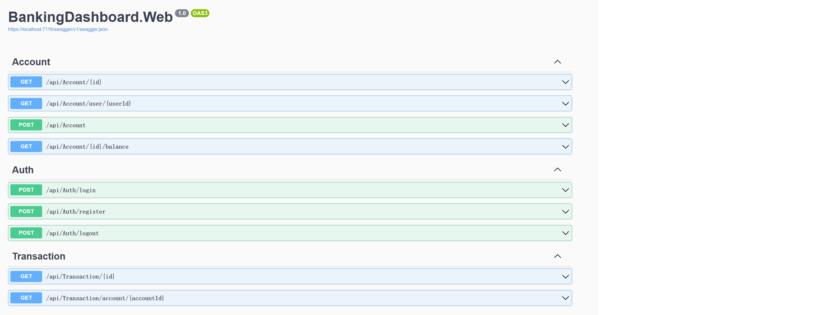
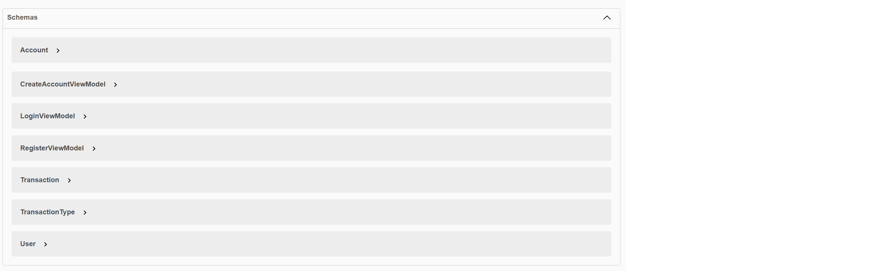
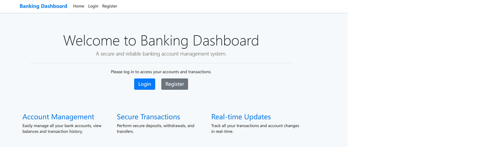

# Banking Dashboard

A full-stack banking dashboard application built with ASP.NET Core MVC and Entity Framework Core.

## Screenshots

### Dashboard Overview

*Main dashboard showing account overview and recent transactions*

### Transaction History

*Detailed transaction history with filtering and sorting capabilities*

### Account Management

*Account management interface for handling multiple accounts*

### Security Features

*Advanced security features and authentication system*

## Features

* Secure user authentication and authorization
* Account management
* Transaction history
* Fund transfers between accounts
* Real-time balance updates
* Responsive design
* Dashboard with account overview
* User registration and login
* Multi-account support

## Technology Stack

* **Frontend**: ASP.NET Core MVC, Bootstrap 5, JavaScript
* **Backend**: .NET 8, Entity Framework Core
* **Database**: SQL Server
* **Authentication**: JWT Authentication
* **Development Tools**: Visual Studio 2022, Git
